# 👗 TailorEase –Custom Tailoring Platform

TailorEase is a Django-based web application that enables seamless online custom tailoring experiences for customers and vendors. The platform supports role-based access, product management, fabric recommendations, cart functionality, and order.

## 🚀 Features

- 👤 User Authentication & Role Upgrades (Customer ↔ Vendor)
- 🧵 Vendors can:
  - Add garments with model, size, price, image
  - Manage inventory and orders via dashboard
- 🛍️ Customers can:
  - Browse products
  - Add to Cart, Customize or Purchase
  - Submit measurement details
  - Track orders
- 📦 Order management for both roles
- 🧾 Profile view with role-specific fields

## 🛠️ Tech Stack

- Backend: Django, Django REST Framework
- Frontend: Django Templates + Bootstrap
- Database: SQLite3

---

## 🧑‍💻 Installation Guide

### Prerequisites

- Python 3.8+
- PostgreSQL
- Git
- pip / virtualenv

### Clone the repository

```bash
git clone https://github.com/azmeerasravan/TailorEase.git
cd TailorEase

python3 -m venv venv
source venv/bin/activate  # On Windows: venv\Scripts\activate

pip install -r requirements.txt

### Apply migrations
python manage.py makemigrations
python manage.py migrate

python manage.py runserver
```

Login Page
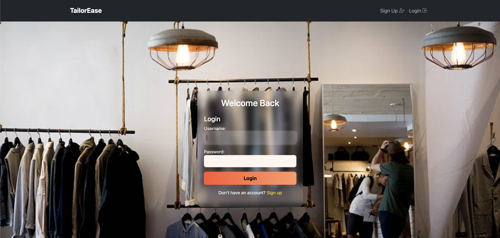


Sign in Page
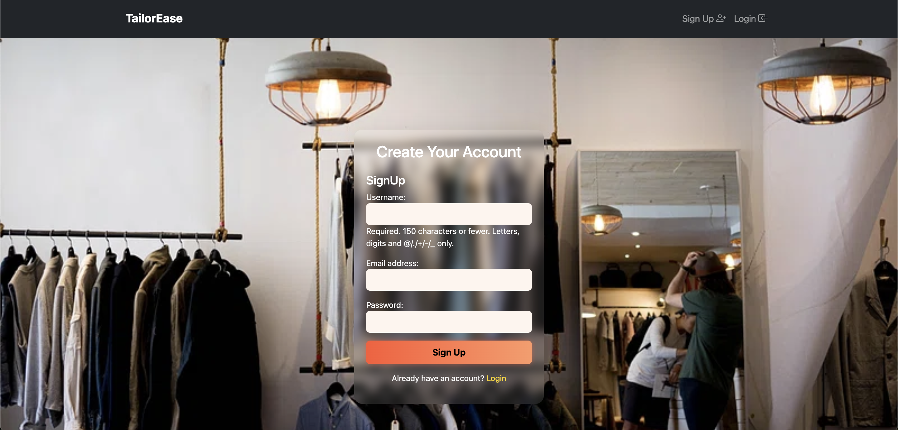

Customer Interface
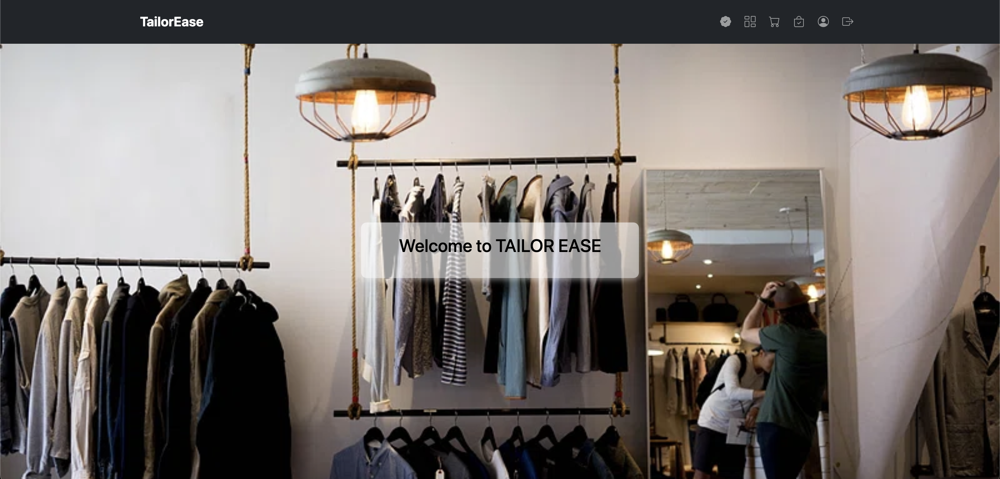

Customer Dashboard
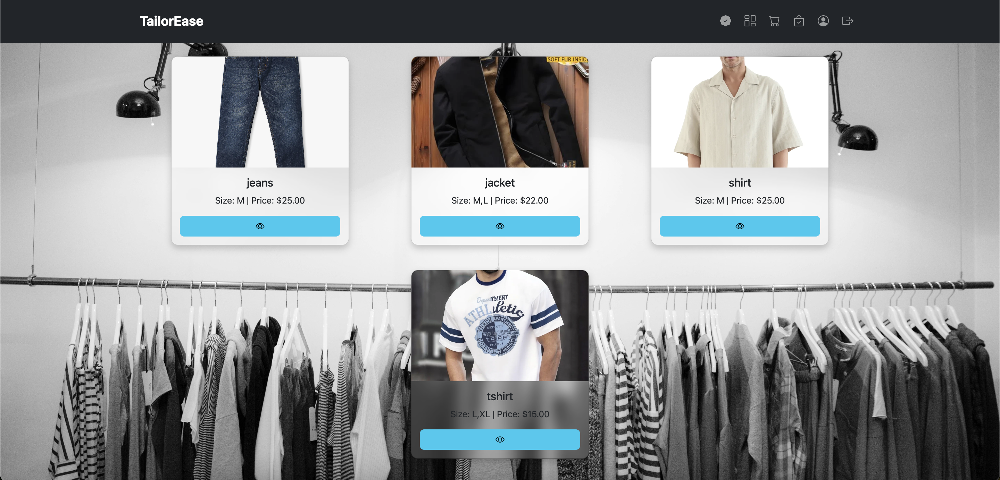

View Product
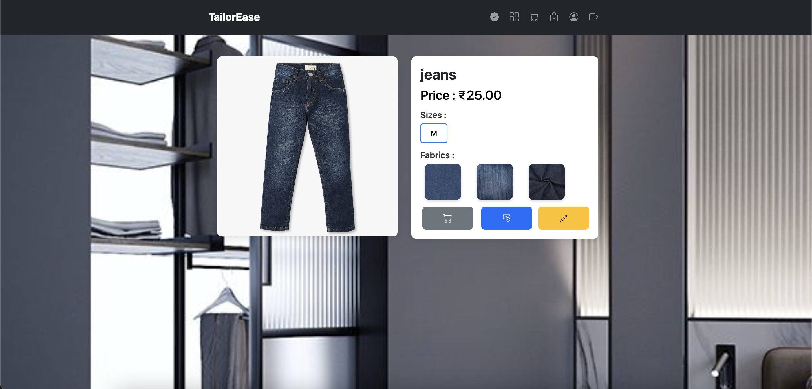

Customize Product
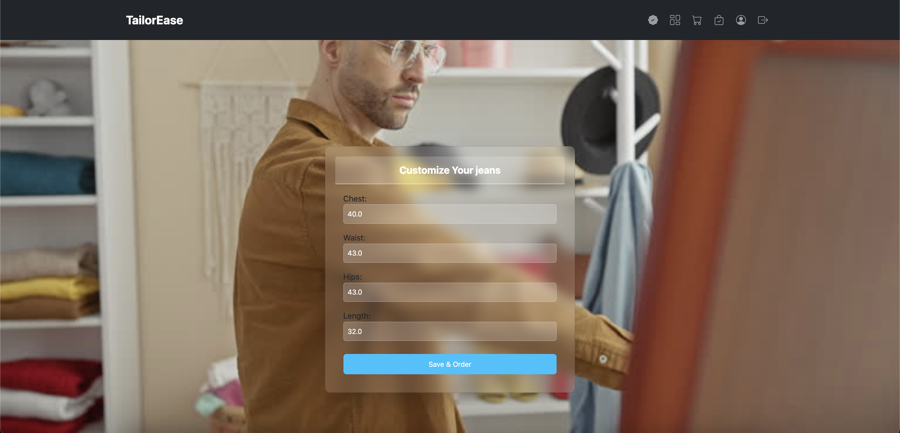

Customer Cart
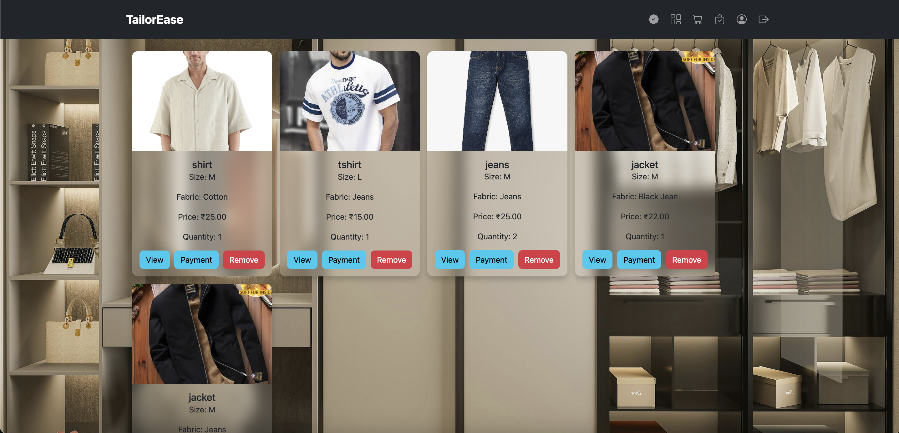

Cutomer Order Tracking
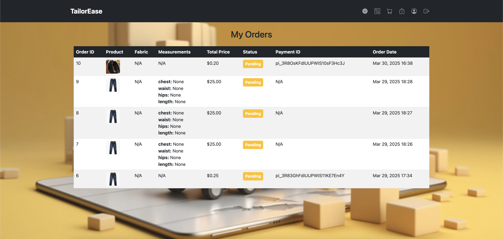

Customer Profile
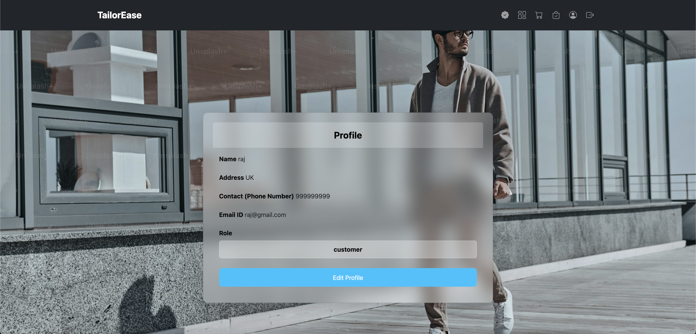

Payment Interface
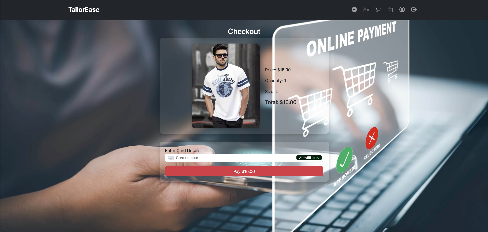

Vendor Interface


Vendor Dashboard
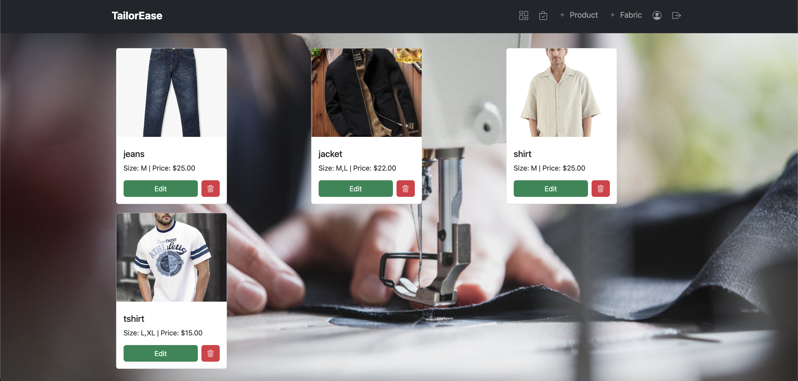

Orders Received


Add Product


Add Fabric
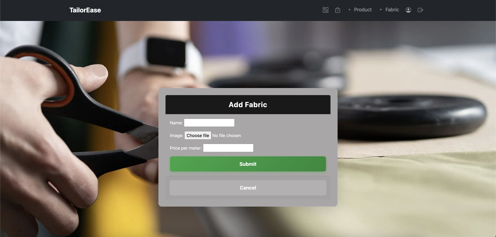

Edit Product
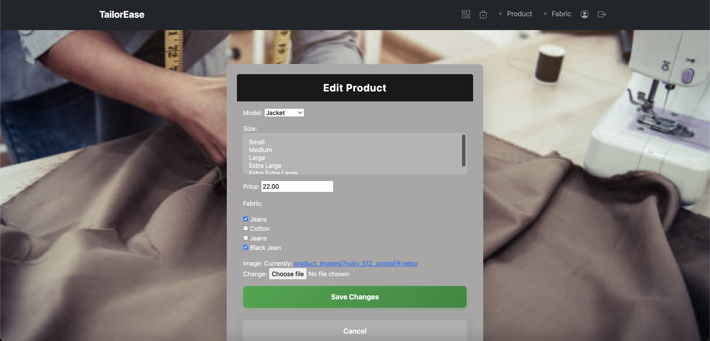

Vendor Profile
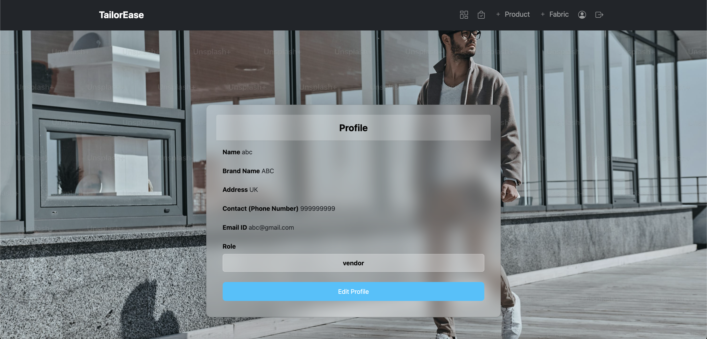


